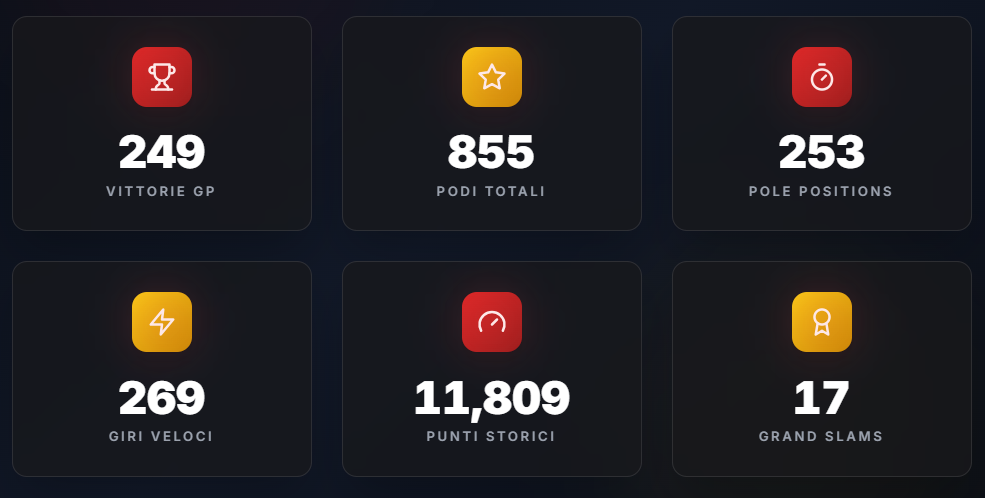

# 🏎️ Formula Rossa – Data Intelligence Scuderia Ferrari F1

[](https://formula-rossa.it)
[](LICENSE)
[](https://github.com/J0joFra/formula_rossa/graphs/commit-activity)

**Formula Rossa** è una piattaforma indipendente dedicata all'analisi statistica avanzata e alla visualizzazione dei dati storici della **Scuderia Ferrari** nel campionato mondiale di Formula 1. Il progetto mira a trasformare numeri complessi in grafici intuitivi per tutti gli appassionati del Cavallino Rampante.

## 📸 Preview del Progetto

<p align="center">
  
  
</p>

---

## 🚀 Caratteristiche Principali

- **📊 Dashboard Interattiva:** Analisi in tempo reale di vittorie, podi, pole position e giri veloci.
- **📚 Archivio Storico:** Database completo che copre le stagioni storiche della Scuderia, dai tempi di Ascari fino all'era moderna.
- **📈 Confronto Piloti:** Strumenti per comparare le performance dei piloti Ferrari attraverso le diverse ere tecnologiche.
- **⚡ Performance-First:** Ottimizzato per caricamenti rapidi e consultazione fluida dei dati.
- **📱 Mobile Responsive:** Design adattabile per un'esperienza perfetta su smartphone, tablet e desktop.

## 🛠️ Stack Tecnologico

Il progetto utilizza le ultime tecnologie nel campo dello sviluppo web e della data visualization:

*   **Frontend:** [Next.js](https://nextjs.org/) / [React](https://reactjs.org/)
*   **Styling:** [Tailwind CSS](https://tailwindcss.com/) (per un design moderno e reattivo)
*   **Grafici:** [Chart.js](https://www.chartjs.org/) o [Recharts](https://recharts.org/)
*   **Data Source:** [Ergast Developer API](http://ergast.com/mrd/) / [FastF1](https://github.com/theOehrly/FastF1)
*   **Deployment:** [Vercel](https://vercel.com/)

## 💻 Installazione Locale

Se desideri clonare il progetto e testarlo localmente, segui questi passaggi:

1.  **Clona il repository:**
    ```bash
    git clone https://github.com/J0joFra/formula_rossa.git
    cd formula_rossa
    ```

2.  **Installa le dipendenze:**
    ```bash
    npm install
    # oppure
    yarn install
    ```

3.  **Crea un file `.env` (se necessario):**
    Aggiungi le tue chiavi API o configurazioni specifiche basandoti sul file `.env.example`.

4.  **Avvia l'ambiente di sviluppo:**
    ```bash
    npm run dev
    ```
    Visita `http://localhost:3000` per vedere il sito in funzione.

## 🤝 Contribuire

Le Pull Request sono le benvenute! Se vuoi migliorare il codice o aggiungere nuove statistiche:

1.  Fai un **Fork** del progetto.
2.  Crea un **Branch** per la tua modifica (`git checkout -b feature/MiglioriaStatistiche`).
3.  Fai il **Commit** dei tuoi cambiamenti (`git commit -m 'Aggiunta nuova visualizzazione podi'`).
4.  Fai il **Push** sul branch (`git push origin feature/MiglioriaStatistiche`).
5.  Apri una **Pull Request**.

## ⚖️ Disclaimer

**Formula Rossa** è un progetto amatoriale e indipendente. **Non è affiliato, associato, sponsorizzato o approvato da Ferrari S.p.A.** o dal gruppo Formula One (FOM). Tutti i marchi, nomi di scuderie e loghi appartengono ai rispettivi proprietari e sono utilizzati qui a solo scopo informativo e di analisi statistica.

## 📩 Contatti

**J0joFra** - [Profilo GitHub](https://github.com/J0joFra)  
**Sito Ufficiale:** [formula-rossa.it](https://formula-rossa.it)  
**Email:** info@formula-rossa.it

---
*Fatto con ❤️ da un tifoso, per i tifosi.*